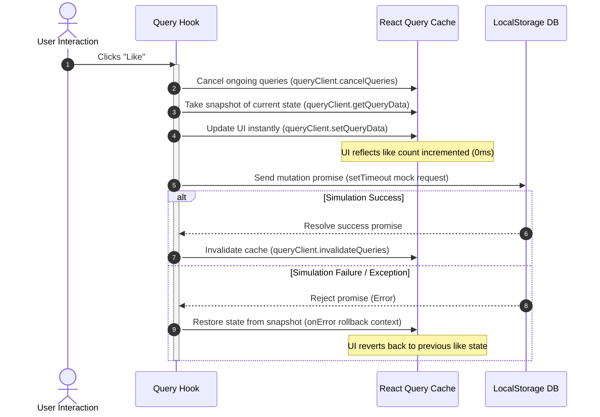

# 🏗️ Application Architecture

VOIDCAFE is designed as a highly responsive client-side Single Page Application (SPA). By leveraging browser storage APIs and state query managers, it simulates a full server experience (complete with database synchronization, cache invalidations, and prefetching queries) with zero backend setup.

---

## 🎛️ Global State Store: Zustand

Global visual configurations, audio volumes, and user session variables are managed by **Zustand**. 

### Selective State Persistence (Partialization)
To keep the application boot logic clean, we split states into long-term stored values and volatile session variables:

1. **`authStore.ts`**:
   - Stores current logged-in user profile, display names, and biases.
   - Fully persisted in local storage under key `voidcafe_auth` so sessions survive browser restarts.
2. **`preferencesStore.ts`**:
   - Stores user preferences (`feedMode` type, `synthVolume` level, and LFO `synthGlitchRate` percentage).
   - **Selective Persistence**: Screen overlays (`terminalOpen` state, `createModalOpen` thread-modal state, and `preloaded` lock-screen flag) are **excluded** from persistence using Zustand's `partialize` parameter:
     ```typescript
     partialize: (state) => ({
       feedMode: state.feedMode,
       synthVolume: state.synthVolume,
       synthGlitchRate: state.synthGlitchRate,
     })
     ```
     This ensures that refreshing the browser always launches the preloader lock-screen and closes all modal overlays, while retaining the user's volume settings.

---

## 🧭 Routing Engine: TanStack Router

VOIDCAFE utilizes **TanStack Router** (v1) for strict TypeScript-first, file-based routing.

- **File-based Generation**: Routes defined inside [src/routes/](file:///d:/Project/VOIDCAFE/src/routes/) are parsed by the TanStack plugin to generate [routeTree.gen.ts](file:///d:/Project/VOIDCAFE/src/routeTree.gen.ts).
- **Code Splitting**: Nested route paths (like `/profile` or `/thread/$threadId`) are compiled into code-split chunks. The browser only fetches the script code required for the current viewport.
- **Unified Wrappers**: The root layout `__root.tsx` renders shared elements (navbars, mobile navigation menus, floating particle canvas, and search overlays) alongside a central `<Outlet />` node, enabling smooth page-blur transitions.

---

## 🔄 Data Caching: TanStack Query (v5)

Data loading and writing functions run through **TanStack Query (React Query)** to keep caches clean.

### 1. Cache Lifespans
- `staleTime`: Set to 5 minutes (`300000ms`). Queries stay fresh in memory, preventing network simulation delays when switching pages.
- `gcTime`: Set to 30 minutes. Inactive query data is garbage collected.

### 2. Prefetching & Placeholder Keeping
To make page navigation instant, we implement two key patterns:
- **Placeholder Data**: Paginated query hooks use `placeholderData: (previousData) => previousData`. When clicking page links, React keeps displaying the current page elements instead of rendering a blank loading screen while fetching the next dataset.
- **Adjacent Prefetching**: When the feed component mounts, it prefetches the page before and after the current viewport in the background:
  ```typescript
  if (page < totalPages) {
    queryClient.prefetchQuery({
      queryKey: ['threads', 'paginated', filters, page + 1, limit],
      queryFn: () => fetchPaginatedThreads(filters, page + 1, limit),
    })
  }
  ```
  This reduces load times to **0ms** when users browse pages sequentially.

---

## ⚡ Optimistic Updates with Rollback Flow

For user likes (Threads/Comments), we update the cache instantly before waiting for the database simulation promise to resolve. If the simulated network request fails, we roll back to the snapped state.


This flow is fully implemented inside [useThreads.ts](file:///d:/Project/VOIDCAFE/src/hooks/useThreads.ts) (`useLikeThread` hook) and [useComments.ts](file:///d:/Project/VOIDCAFE/src/hooks/useComments.ts) (`useLikeComment` hook).
