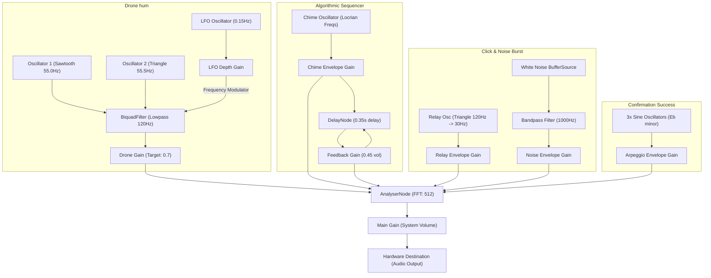

# 🔊 Web Audio API Synthesizer & Acoustic Feedback Engine

VOIDCAFE utilizes a native Web Audio API synthesizer engine declared in [synth.ts](file:///d:/Project/VOIDCAFE/src/lib/synth.ts). It generates real-time audio, textures, ambient chimes, and micro-audio feedback indicators directly inside the browser, with **zero external static sound assets** (no WAV or MP3 files needed).

This document details the node schematics, audio logic, and instructions for customizing the synthesizer's behavior.

---

## 📐 Node Routing Graph

The synthesizer runs multiple audio sources (drone oscillators, chimes, noise buffers, and user feedback nodes) through a centralized analyser and gain control before outputting to the hardware destination:



---

## 🛸 Core Audio Modules

### 1. The Sub-Drone Hum (`setupDrone()`)
Generates the low-frequency background ambiance:
- **Beating Effect**: Combines `OscillatorNode` #1 (sawtooth wave at 55Hz - A1) and `OscillatorNode` #2 (triangle wave at 55.5Hz). The slight 0.5Hz frequency mismatch produces organic phase cancellation (beating), making the drone sound alive and dynamic.
- **Filter Modulation (LFO)**: A slow Low-Frequency Oscillator (`lfoNode` at 0.15Hz) sweeps the lowpass filter cutoff frequency up and down by ±40Hz. This creates the pulsing, breathing "horror swell" effect.

### 2. Algorithmic Spooky Chimes (`startSequencer()`)
Every 2 seconds, an interval runs to decide whether to trigger ambient sounds (60% probability):
- **Locrian Scale Frequencies**: Frequencies are selected from a spooky Locrian/Minor scale:
  `SCALE = [110.00Hz, 123.47Hz, 130.81Hz, 146.83Hz, 155.56Hz, 174.61Hz, 196.00Hz, 220.00Hz]`
- **Harmonics**: Shifts the picked frequency up by 2 or 4 octaves and plays a sine wave chime with a quick attack and a long decay envelope (1.5s - 3.5s).
- **Echo feedback**: The chime is routed to a `DelayNode` set to a 0.35-second delay, feeding back into itself at 45% volume (`delayGain = 0.45`), creating repeating, decaying echoes.

### 3. Tactile UI Acoustic Feedbacks
- **Hover Blip (`playHover()`)**: Plays a high-frequency sine wave pitch slide (`1400Hz` -> `2000Hz`) over a quick `0.015`-second envelope to simulate a digital tick.
- **Click Relay (`playClick()`)**: Combines a triangle wave pitch drop (`120Hz` -> `30Hz`) over `0.03` seconds with a generated 8ms buffer containing random math numbers (white noise) filtered through a bandpass filter (1000Hz) to simulate a mechanical relay switch click.
- **Success Chime (`playSuccess()`)**: Plays a rapid Eb minor arpeggio sequence (`Eb5` - 622Hz, `Gb5` - 739Hz, `Bb5` - 932Hz) offset by 60ms to create a rewarding confirm sound.

---

## 📊 Live Oscilloscope Visualizer

The Canvas oscilloscope rendered inside the [synth-widget.tsx](file:///d:/Project/VOIDCAFE/src/components/ui/synth-widget.tsx) component is bound to the engine's centralized `AnalyserNode`:

1. **FFT Size**: Configured to `512` in [synth.ts](file:///d:/Project/VOIDCAFE/src/lib/synth.ts) to store `256` time-domain data frames.
2. **Animation Loop**: Uses `requestAnimationFrame` to retrieve real-time wave frames using `analyser.getByteTimeDomainData(dataArray)`.
3. **Canvas Drawing**: Draws a path by mapping values:
   - `v = dataArray[i] / 128.0`
   - `y = (v * height) / 2`
4. **Neon Stroke Styling**: Drawn with a light neon purple stroke:
   - `ctx.strokeStyle = '#c084fc'`
   - `ctx.shadowColor = '#a855f7'`
   - `ctx.shadowBlur = 6`
5. **Standby Mode**: If the synth engine is offline, the drawing loop renders a flat horizontal baseline with minor randomized vertical vibrations to indicate system standby.

---

## 🔧 Synthesizer Customization Guide

You can easily modify the synthesizer's behavior in [synth.ts](file:///d:/Project/VOIDCAFE/src/lib/synth.ts).

### 1. Changing the Base Key & Scale
To change the musical mood of the chimes, update the `SCALE` array with your own frequencies:
```typescript
// Example: Change from Locrian to a bright C Major pentatonic scale
const SCALE = [261.63, 293.66, 329.63, 392.00, 440.00] // C4, D4, E4, G4, A4
```

### 2. Modifying the Drone Hum Pitch
To raise or lower the background cybernetic hum, update the frequency values inside `setupDrone()`:
```typescript
// Example: Lower base drone to D1 (36.71Hz) and D#1 (38.89Hz)
osc1.frequency.value = 36.71
osc2.frequency.value = 38.89
```

### 3. Adjusting the Delay Time and Feedback
To change the echo distance and feedback volume of the chimes:
- Change the delay time on line 232:
  ```typescript
  delay.delayTime.value = 0.50 // 0.5-second echo intervals
  ```
- Change the feedback multiplier on line 233:
  ```typescript
  delayGain.gain.value = 0.60 // Echo decays slower (60% feedback)
  ```
